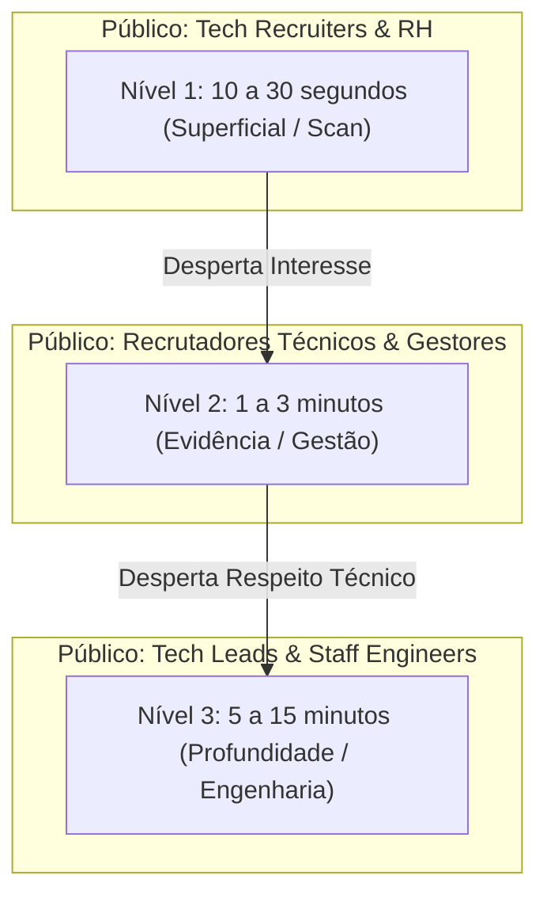

# MAPEAMENTO DE MERCADO, AVALIADORES E CONCORRÊNCIA — FASE 2

*Documento de análise do mercado de contratação, perfis de avaliadores e diferenciação estratégica.*

---

## 1. O Funil de Avaliação Duplo e a Arquitetura em 3 Níveis

O portfólio e os pontos de contato da marca não tentarão agradar a todos com uma mensagem única. Eles serão desenhados com **três camadas progressivas de profundidade**:

### Detalhamento dos Níveis:
* **Nível 1 (10–30s) — Scan Imediato:**
  * *Público:* RH e Tech Recruiters.
  * *Perguntas que responde:* Quem é Aelton? Qual é o cargo/foco (Analytics Engineer)? Quais tecnologias domina? Quais problemas resolve?
  * *Sensação transmitida:* Clareza, estética sofisticada, alta empregabilidade e objetividade.
* **Nível 2 (1–3 min) — Evidência de Competência:**
  * *Público:* Recrutadores técnicos, Gerentes de Dados e Coordenadores.
  * *Perguntas que responde:* Quais projetos foram entregues em produção? Quais foram as métricas de negócio impactadas? Como funcionam as integrações?
  * *Sensação transmitida:* Capacidade real de gerar valor e visão ponta a ponta de negócio.
* **Nível 3 (5–15 min) — Profundidade de Engenharia:**
  * *Público:* Tech Leads, Engenheiros de Dados Seniores e Arquitetos.
  * *Perguntas que responde:* Como o código foi estruturado? Como tratou concorrência, idempotência, duplicatas e falhas de API? Como desenhou o modelo dimensional SQL? Onde estão os testes e a documentação?
  * *Sensação transmitida:* Rigor técnico, código limpo, maturidade e autonomia investigativa.

---

## 2. Diagnóstico da Concorrência: O "Mar Vermelho"

| O que a Concorrência Faz (Superficial) | O que a Marca Aelton Fará (Diferenciação Real) |
| :--- | :--- |
| Publica dezenas de projetos de curso copiados (Titanic, vendas fictícias) | Apresenta problemas reais de produção de startup |
| Mostra apenas o dashboard final colorido | Mostra o racional, o modelo de dados, as transformações e o código por trás |
| Trata ferramentas como selos em um álbum de figurinhas | Demonstra como opera, mantém e depura pipelines sob falhas |
| Ignora tratamento de exceções, idempotência e qualidade do dado | Mostra decisões de engenharia (ex: mediana contra outliers, tratamento de webhook com retry) |

---

## 3. A Dor Oculta do Tech Lead (O Job-to-be-Hired)

O maior receio de um Tech Lead ao contratar um profissional júnior/pleno é **aumento de carga cognitiva e retrabalho**.
* O candidato fraco trava diante de um erro de API, gera duplicatas no banco e devolve o problema para o sênior resolver.
* **A Proposta de Valor do Aelton para a Squad:** Provar que é o profissional que **reduz o atrito do Tech Lead**:
  1. Investiga a causa raiz antes de pedir ajuda.
  2. Comunica bloqueios proativamente antes que virem atrasos.
  3. Escreve código desacoplado e legível que outro engenheiro consegue manter.
  4. Valida e testa entregas pensando em edge cases.
  5. Entende a matemática e o impacto no negócio além da sintaxe.

---

## 4. Definição do Título-Âncora
* **Transição Oficial:** *Analista de Dados* -> **Analytics Engineer**
* **Justificativa Estratégica:** O Analytics Engineer é exatamente a ponte que domina a engenharia de dados (pipelines, APIs, SQL, orquestração) sem perder a sensibilidade analítica de negócio e modelagem para tomada de decisão.
