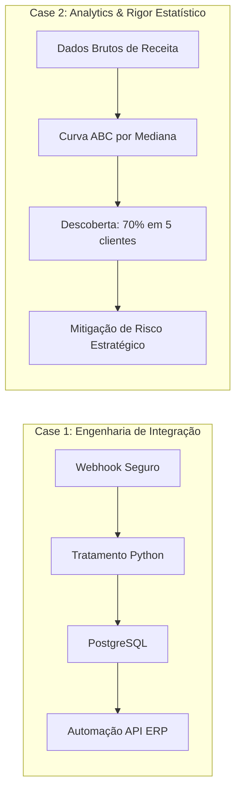

# ARQUITETURA DOS CASES E PROPOSTA DE VALOR — FASE 3

*Estruturação dos cases de produção nos 3 Níveis de Leitura para o portfólio de Aelton SM.*

---

## 1. Matriz de Valor dos Cases-Âncora

---

## 2. Detalhamento dos Cases

### CASE 01: Pipeline de Integração E2E com Ofuscação de Camada e Consumo de ERP
* **Tema:** Engenharia de Dados, Integração de APIs e Segurança Operacional.
* **Stack:** Python, Webhooks, PostgreSQL, APIs REST, n8n.
* **Os 3 Níveis de Leitura:**
  * **Nível 1 (Scan):** *"Pipeline automatizado ponta a ponta: captura segura via webhook, higienização de payload em Python, persistência em PostgreSQL e disparo para ERP."*
  * **Nível 2 (Evidência de Negócio):** Eliminação de entrada manual de dados, automação do funil comercial e integração sem fricção entre marketing e operação.
  * **Nível 3 (Engenharia & Trade-offs para Tech Leads):**
    * *Segurança e Ofuscação:* Camada de ingestão desacoplada que responde ao usuário com confirmação sem vazar metadados do webhook ou da infraestrutura interna.
    * *Idempotência e Resiliência:* Tratamento de retries da API do ERP e garantia de não duplicação de registros em caso de timeout.

### CASE 02: Auditoria de Risco e Curva ABC por Mediana (Proteção contra Outliers)
* **Tema:** Analytics Engineering, Modelagem Estatística e BI Estratégico.
* **Stack:** SQL, Python/Pandas, Power BI / Looker.
* **Os 3 Níveis de Leitura:**
  * **Nível 1 (Scan):** *"Análise preditiva de risco e concentração de receita com modelagem de Curva ABC robusta a outliers."*
  * **Nível 2 (Evidência de Negócio):** Revelação de risco existencial para a liderança da startup: **70% de toda a receita da empresa concentrada em apenas 5 clientes** (com um único cliente representando 16%).
  * **Nível 3 (Engenharia & Rigor para Tech Leads):**
    * *Por que Mediana em vez de Média:* A demonstração matemática de como outliers de ticket médio mascaravam a vulnerabilidade real da carteira.
    * *Modelagem SQL & Performance:* Queries dimensionais estruturadas para atualização incremental sem sobrecarregar o banco de produção.
