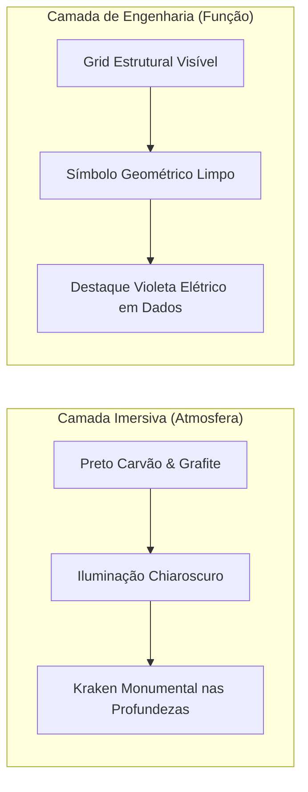

# DIRETRIZES DE IDENTIDADE VISUAL — FASE 6

*Sistema visual "Chiaroscuro Tech", paleta cromática, tipografia e regras de aplicação do símbolo Kraken para Aelton SM.*

---

## 1. O Conceito Visual: "Chiaroscuro Tech"

A identidade visual funde o **Maximalismo Cinematográfico Clássico** (dramaticidade, profundidade de campo, luz e sombra das águas profundas) com o **Rigor Estrutural de Engenharia** (grid visível, tipografia técnica, cards arquiteturais e dados de alta precisão).



---

## 2. Sistema de Cores (Paleta Calibrada)

| Nome da Cor | Hex Code | Função no Sistema | Aplicação |
| :--- | :--- | :--- | :--- |
| **Abyss Black** | `#0B0B0E` | Fundo primário | Superfície base do site e aplicações |
| **Charcoal Carbon** | `#141418` | Fundo de elevação | Cards arquiteturais, molduras e containers |
| **Graphite Border** | `#26262E` | Estrutura de grid | Linhas verticais, divisores e bordas de cards |
| **Text Primary** | `#EDEDF0` | Leitura principal | Títulos, métricas-chave e dados principais |
| **Text Muted** | `#8E8E98` | Leitura de suporte | Descrições, metadados e labels técnicas |
| **Chiaroscuro Light** | `#F5E6CC` (pontual) | Acento atmosférico | Iluminação tênue e quente no cenário cinemático |
| **Data Violet** | `#7C3AED` | Acento de dados | Pontos ativos em gráficos, badges e botões |
| **Electric Pulse** | `#A78BFA` | Acento interativo | Hover states, links ativos e glow sutil em dados |

> **Regra de Ouro Cromática:** O roxo/violeta não cobre o site inteiro. Ele é a **"luz dos dados"** — reservado exclusivamente para gráficos, métricas analíticas e interações que guiam o olhar do Tech Lead.

---

## 3. Sistema Tipográfico

O sistema combina elegância editorial com precisão técnica de código:

### Tipografia 1: Sans-Serif Geométrica (Títulos e Display)
* **Fontes Recomendadas:** *Space Grotesk*, *Inter* ou *Syne*.
* **Uso:** Nome da marca (`AELTON SM`), títulos de seções (`SELECTED WORKS`), headlines conceituais.
* **Características:** Pesos médios e fortes (Medium, Semi-Bold), caixa alta (uppercase) com kerning/tracking ligeiramente aberto em títulos para transmitir arquitetura e presença.

### Tipografia 2: Monospace de Engenharia (Dados, Código e Metadados)
* **Fontes Recomendadas:** *JetBrains Mono*, *Fira Code* ou *Space Mono*.
* **Uso:** Métricas numéricas (ex: `70% REVENUE CONCENTRATION`), tags de stack (ex: `[Python / SQL / PostgreSQL]`), tempo de execução, trechos de código e badges de status.
* **Características:** Alinhamento tabular impecável, transmitindo a estética de terminal/IDE de dados.

---

## 4. O Sistema do Símbolo Kraken

O símbolo atua em dois papéis complementares e estritamente separados:

```text
┌─────────────────────────────────────────────────────────────┐
│ 1. SÍMBOLO FUNCIONAL / MONOGRAMA (Vetor Geométrico Limpo)   │
│ - Base: referencia01.jpg (sem circuitos nos tentáculos)     │
│ - Uso: Favicon, Navbar, GitHub Avatar, Assinatura Técnica   │
│ - Tamanhos: 16px, 32px, 64px, 128px                         │
│ - Traço: Linhas precisas, polígonos puros, alta redução     │
└─────────────────────────────────────────────────────────────┘

┌─────────────────────────────────────────────────────────────┐
│ 2. ARTE MONUMENTAL CINEMATOGRÁFICA (Hero das Profundezas)   │
│ - Uso: Imagem de fundo do Hero (primeira dobra do site)     │
│ - Estilo: Chiaroscuro dramático, atmosfera de águas         │
│   profundas, silhueta do Kraken integrada a fluxos de luz  │
│ - Transmite: Domínio sobre a complexidade e magnitude       │
└─────────────────────────────────────────────────────────────┘
```

---

## 5. Assinatura Institucional (Lockup Oficial)

```text
[  SÍMBOLO KRAKEN (referencia01)  ]  |  AELTON SM · ANALYTICS ENGINEER
```
* **Versão Horizontal:** Para cabeçalhos, rodapés e LinkedIn banner.
* **Versão Compacta:** Símbolo isolado (avatar) com "Aelton SM" abaixo.
