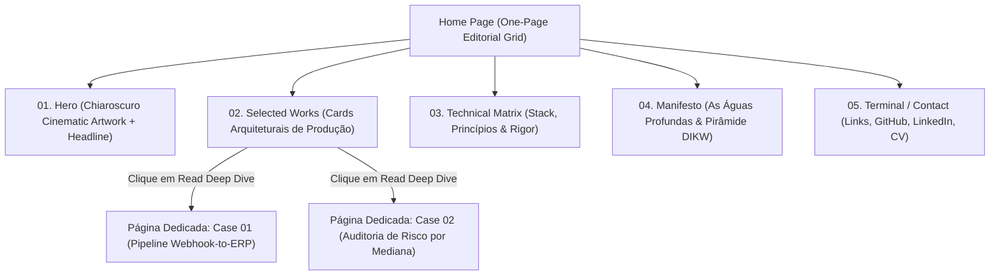

# ESPECIFICAÇÃO DE ARQUITETURA E UX DO PORTFÓLIO — FASE 8

*Estrutura de seções, wireframes conceituais, experiência do usuário e template de Case Study para o site de Aelton SM.*

---

## 1. Arquitetura de Informação (Sitemap)



---

## 2. Blueprint das Seções da Home

### Seção 1: Navigation Pill (Barra Flutuante Fixa)
* **Left:** `[ 🐙 ] AELTON SM · ANALYTICS ENGINEER`
* **Center (Links de Âncora):** `01. Overview` · `02. Selected Works` · `03. Stack` · `04. Philosophy` · `05. Contact`
* **Right:** Seletor de Idioma `[ EN | PT ]` + Botão CTA `[ Download CV / Resume ]`

### Seção 2: Hero Section (Impacto Imediato / 10 a 30s)
* **Atmosfera de Fundo:** Ilustração/Render do Kraken nas águas profundas sob iluminação Chiaroscuro sutil, com malha geométrica e linhas de coordenadas.
* **Status Badge:** `● AVAILABLE FOR MID ANALYTICS ROLES · Q4 2026`
* **Headline Principal:**
  ```text
  AELTON SM
  ENGINEERING THE UNSEEN FOUNDATIONS OF DATA.
  From resilient pipelines to statistical truth — turning operational chaos into business predictability.
  ```
* **Micro-CTAs:** `[ Explore Production Cases ↓ ]` · `[ View GitHub Repositories ↗ ]`
* **Grid Lines:** Linhas verticais tênues no padrão `#26262E` cortando sutilmente a página.

### Seção 3: Selected Works (Evidência em 1 a 3 minutos)
* Título Editorial com marca d'água no fundo: `SELECTED WØRKS`
* **Card 01:**
  * *Mockup/Visual:* Diagrama arquitetural isométrico ou fluxo com nós ativos em violeta.
  * *Tags:* `DATA INTEGRATION` · `PYTHON` · `POSTGRESQL` · `WEBHOOKS` · `ERP API`
  * *Headline:* **E2E Ingestion Pipeline with Obfuscated Execution & Automated ERP Sync**
  * *Métrica de Negócio:* Eliminação de 100% da inserção manual e latência de processamento em tempo real.
  * *Ação:* Botão `[ Read Engineering Deep Dive → ]`
* **Card 02:**
  * *Mockup/Visual:* Gráfico de distribuição com mediana em destaque roxo e cauda de outliers em cinza.
  * *Tags:* `ANALYTICS ENGINEERING` · `STATISTICAL MODELING` · `SQL` · `POWER BI`
  * *Headline:* **Revenue Risk Audit: Mitigating 70% Concentration Risk via Median Distribution**
  * *Métrica de Negócio:* Detecção de vulnerabilidade crítica oculta (70% da receita em 5 clientes).
  * *Ação:* Botão `[ Read Engineering Deep Dive → ]`

### Seção 4: Stack & Rigor Técnico (Engineering Matrix)
Organização da stack por camadas funcionais (sem logomarcas infantis; tipografia monoespaçada limpa):
1. **Ingestion & Transport:** Python, REST APIs, Webhook Security, n8n, Custom Handlers.
2. **Storage & Warehousing:** PostgreSQL, MySQL, Data Modeling, S3 (Roadmap).
3. **Analytics & Modeling:** Advanced Modular SQL, Statistical Rigor (Medians, Quantiles), Pandas.
4. **Consumption & BI:** Power BI, Looker Studio, DAX/Analytical Measures, Executive Dashboards.

### Seção 5: The Deep Waters Manifesto (A Filosofia da Marca)
* Exposição elegante da **Pirâmide DIKW** e da analogia das águas profundas:
  > *"Data is not a bakery. Real engineering happens beneath the surface where systems are decoupled, audited, and resilient to failure."*

### Seção 6: Footer / Terminal de Contato
* Links diretos para LinkedIn, GitHub, Email, e link para download do CV em PDF.

---

## 3. Especificação da Página Dedicada de Case Study (Nível 3 / 5 a 15 min)

Cada case study individual funcionará como um **artigo técnico de engenharia** de alto escalão (estilo Uber/Stripe Engineering Blog):

1. **Header do Case:**
   * Título completo, data de implantação, papel (`Analytics Engineer / Solo`), tecnologias utilizadas.
2. **O Problema de Negócio (The Context & Problem):**
   * O que estava quebrado, lento ou mascarado no estado anterior.
3. **Diagrama Arquitetural da Solução (Architecture Diagram):**
   * Diagrama limpo em blocos mostrando o fluxo de ponta a ponta.
4. **Decisões Críticas de Engenharia & Trade-offs (Engineering Decisions):**
   * *Por que escolhi X e não Y?*
   * Exemplo: Por que a mediana foi calculada em vez da média ponderada? Como o webhook foi protegido contra spoofing?
5. **Trechos de Código Comentados (Annotated Code Snippets):**
   * Blocos em Python/SQL com tipagem limpa e comentários de manutenção.
6. **Tratamento de Falhas & Casos de Borda (Edge Cases & Resilience):**
   * O que acontecia quando a API de destino dava timeout? Como foi evitada a duplicação?
7. **Impacto Mensurável & Lições Aprendidas (Lessons Learned):**
   * Resultados reais no negócio e o que eu faria diferente na versão 2.0.
8. **Link para o Repositório no GitHub / Documentação Técnica.**
