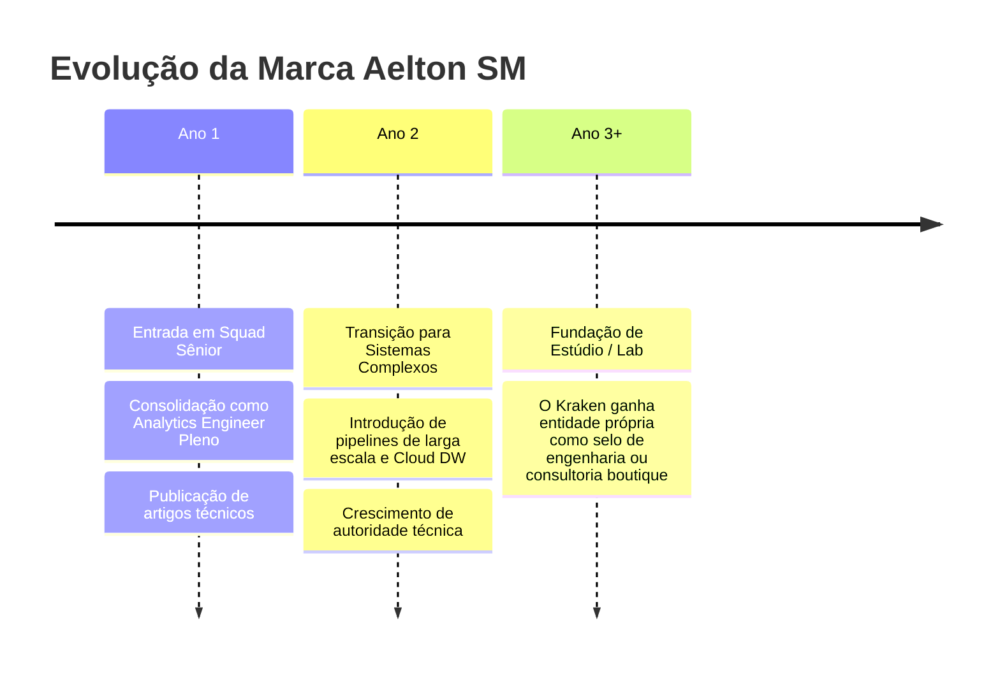

# PLANO DE VALIDAÇÃO E CHECKLIST DE LANÇAMENTO — FASE 9

*Critérios de validação prática, checklist de testes e plano de evolução da marca Aelton SM.*

---

## 1. Critérios de Sucesso da Marca (Validação Prática com o Mercado)

Como o Job to be Done da marca é **atrair Tech Leads e Recrutadores Técnicos para vagas de Analytics Engineer Pleno**, a marca será considerada validada se atingir os seguintes benchmarks nos primeiros 60 dias de exposição ativa:

| Métrica / Teste | Meta de Sucesso | Como Medir |
| :--- | :--- | :--- |
| **Taxa de Resposta de Recrutadores (LinkedIn InMail)** | > 35% de conversão em resposta positiva para entrevistas | Prospecção ativa de vagas e conexões |
| **Tempo de Permanência no Portfólio** | Média > 1m30s (indicando que passaram do Nível 1 para o Nível 2) | Google Analytics / Plausible |
| **Taxa de Clique nos Case Studies (Nível 3)** | > 20% dos visitantes clicam para ler um "Deep Dive" | Event tracking de cliques nos botões |
| **Feedback Qualitativo de Tech Leads** | Elogios específicos sobre o rigor do case (ex: citar a mediana ou arquitetura de webhook) | Perguntar em entrevistas técnicas |

---

## 2. Checklist de Validação Pré-Lançamento

### Teste de 5 Segundos (5-Second Test):
- [ ] Mostrar o Hero do site para 3 colegas da área de tecnologia.
- [ ] Perguntar: *"O que essa pessoa faz e qual é a primeira impressão que ela passa?"*
- [ ] *Critério de aprovação:* Devem responder imediatamente "Engenheiro de dados / Analytics" e citar palavras como "sério", "sofisticado", "técnico", sem confundir com designer, agência ou hacker.

### Teste de Auditoria de Código (Nível 3):
- [ ] O repositório do Case 01 no GitHub tem um `README.md` impecável com diagrama arquitetural e instruções de execução?
- [ ] O repositório do Case 02 tem a explicação matemática clara do motivo de usar mediana e a query SQL limpa e formatada?
- [ ] Não há senhas, tokens ou URLs reais expostas em nenhum arquivo (segurança e ofuscação validadas)?

---

## 3. Checklist de Lançamento e Presença Digital

- [ ] **LinkedIn:**
  - [ ] Headline atualizada: `Aelton SM | Analytics Engineer · Data Systems & Statistical Rigor`
  - [ ] Banner com atmosfera Chiaroscuro e o lockup minimalista da marca.
  - [ ] Seção "Sobre" com a bio institucional aprovada na Fase 7.
  - [ ] Seção de Destaques apontando para o novo portfólio.
- [ ] **GitHub:**
  - [ ] Avatar atualizado com o símbolo minimalista do Kraken (`referencia01`).
  - [ ] README do perfil sincronizado com a identidade visual e links dos cases.
- [ ] **Website / Portfólio:**
  - [ ] Implementação do grid editorial escuro com paleta *Chiaroscuro Tech*.
  - [ ] Botão de alternância EN / PT funcionando.
  - [ ] Download de CV em PDF direto e atualizado.
  - [ ] As duas páginas dedicadas de Case Study publicadas e auditadas.

---

## 4. Plano de Evolução da Marca (Horizonte 1 a 3 anos)

